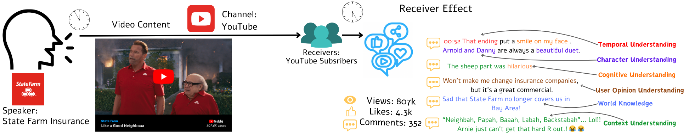
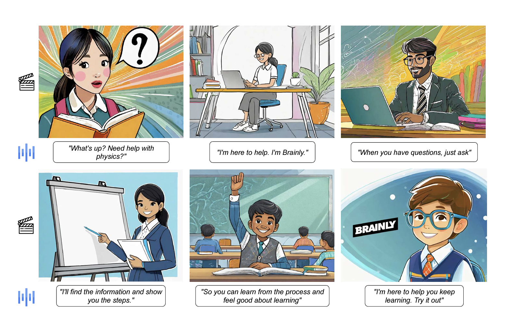

# Long-Term Ad Memorability: Understanding & Generating Memorable Ads

🔥 NEW: We have released the [Behavior LLaVA](https://github.com/behavior-in-the-wild/behavior-llava) dataset, and training scripts! Just replace the data in the train.sh script after processing data from BLIFT.

- [**Memorability Project Page**](https://behavior-in-the-wild.github.io/memorability.html)
- [**Behavior LLaVA Project Page**](https://behavior-in-the-wild.github.io/behavior-llava.html)
- [**Data (LAMBDA)**](https://huggingface.co/datasets/behavior-in-the-wild/LAMBDA)
- [**Data (UltraLAMBDA)**](https://huggingface.co/datasets/behavior-in-the-wild/UltraLAMBDA)
- [**BLIFT Data (Behavior LLaVA)**](https://huggingface.co/datasets/behavior-in-the-wild/BLIFT)
- [**Paper (Memorability)**](https://arxiv.org/abs/2309.00378)
- [**Paper (Behavior LLaVA)**](https://openreview.net/forum?id=ff2V3UR9sC)

<div align="center">
    
    
</div>

---

## Installation and Setup

Follow the steps below to install the required packages and set up the environment.

### Step 1: Clone the Repository

Open your terminal and clone the repository using the following command:

```shell
git clone https://github.com/behavior-in-the-wild/ad-memorability.git
```

### Step 2: Set Up the Conda Environment

Create and activate the Conda environment:

```shell

conda create -n admem python=3.10 -y
conda activate admem
pip install --upgrade pip  # Enable PEP 660 support
pip install -e .
pip install ninja
pip install flash-attn --no-build-isolation
pip install opencv-python
pip install numpy==1.26.4
```

### Step 3: Set Up Model Zoo

Create directories and download the required models:

```shell
mkdir model_zoo
mkdir model_zoo/LAVIS
cd ./model_zoo/LAVIS
wget https://storage.googleapis.com/sfr-vision-language-research/LAVIS/models/BLIP2/eva_vit_g.pth
```

### Step 4: Set Up LLaMA-VID

```shell
cd path/to/ad-memorability
mkdir work_dirs
cd work_dirs
git lfs install
git clone https://huggingface.co/YanweiLi/llama-vid-13b-full-224-video-fps-1
```

### Step 5: Prepare Data Directory

```shell
cd path/to/ad-memorability
mkdir data
cd ./data
```

LAMBDA videos are available on [huggingface](https://huggingface.co/datasets/behavior-in-the-wild/LAMBDA/blob/main/LAMBDAVideos.zip)!

LAMBDA sampled frames coming soon!

1. Create .npy files of your videos. A sample file is given in the sample folder.
2. Store them in as ./data/videos/video_scenes/{id}.npy
3. Similarly, store the images in ./data/images/{id}.npy

## Training

1. Install the desired version of DeepSpeed.

2. Update the train.sh script:
    Replace the --data_path argument with one of the following options, depending on your training task:
        lambda_bs_train.json
        lambda_combine_train.json
        lambda_cs_train.json
        blift.json

3. If you don't have the frames and want to train directly on the video @ 1 FPS, reformat your data as given [here](./data/lambda_train.json)  and replace the --data_path argument with lambda_train.json.

4. If you're training on your own dataset, create a train.json file. Each entry should contain an id and a conversation. You can use lambda_bs_train.json as a reference for formatting.

```shell
bash train.sh
```

## Inference

1. For predicting memorability scores:

```shell
bash eval_bs.sh
```

2. For generating memorable videos:

```shell
bash eval_cs.sh
```

3. For BLIFT:
Transform the test set similar to [this](data/cs_test_q.json)
For videos, follow the same as eval_cs.sh
For images, replace videos with images in eval_cs.sh and replace the gt_file_question and gt_file_answers with the corresponding image files.

## Citation

If you find this repo useful for your research, please consider citing the paper

```bibtex
@InProceedings{Si_2025_WACV,
    author    = {Si, Harini and Singh, Somesh and Singla, Yaman Kumar and Bhattacharyya, Aanisha and Baths, Veeky and Chen, Changyou and Shah, Rajiv Ratn and Krishnamurthy, Balaji},
    title     = {Long-Term Ad Memorability: Understanding \& Generating Memorable Ads},
    booktitle = {Proceedings of the Winter Conference on Applications of Computer Vision (WACV)},
    month     = {February},
    year      = {2025},
    pages     = {5707-5718}
}
@inproceedings{DBLP:conf/iclr/SinghISCSBK25,
  author       = {Somesh Kumar Singh and
                  Harini S. I and
                  Yaman Kumar Singla and
                  Changyou Chen and
                  Rajiv Ratn Shah and
                  Veeky Baths and
                  Balaji Krishnamurthy},
  title        = {Teaching Human Behavior Improves Content Understanding Abilities Of
                  VLMs},
  booktitle    = {The Thirteenth International Conference on Learning Representations,
                  {ICLR} 2025, Singapore, April 24-28, 2025},
  publisher    = {OpenReview.net},
  year         = {2025},
  url          = {https://openreview.net/forum?id=ff2V3UR9sC},
  timestamp    = {Thu, 15 May 2025 17:19:05 +0200},
  biburl       = {https://dblp.org/rec/conf/iclr/SinghISCSBK25.bib},
  bibsource    = {dblp computer science bibliography, https://dblp.org}
}
```

## Acknowledgement

We would like to thank the following repos for their great work:

- This work is built upon the [LLaMA-VID](https://github.com/dvlab-research/LLaMA-VID),[LLaVA](https://github.com/haotian-liu/LLaVA), [Vicuna](https://github.com/lm-sys/FastChat).
- This work utilizes pretrained weights from [InstructBLIP](https://github.com/salesforce/LAVIS).
- We perform video-based evaluation from [Video-ChatGPT](https://github.com/mbzuai-oryx/Video-ChatGPT).
- Behavior LLaVA Dataset is built upon [Reddit](https://www.reddit.com/), [YouTube](https://www.youtube.com/), and [AdsOfTheWorld](https://www.adsoftheworld.com/).

## License

The data and checkpoint is intended and licensed for research use only. They are also restricted to uses that follow the license agreement of LLaMA-VID,LLaVA, LLaMA, Vicuna, Reddit, YouTube, and GPT-4.
